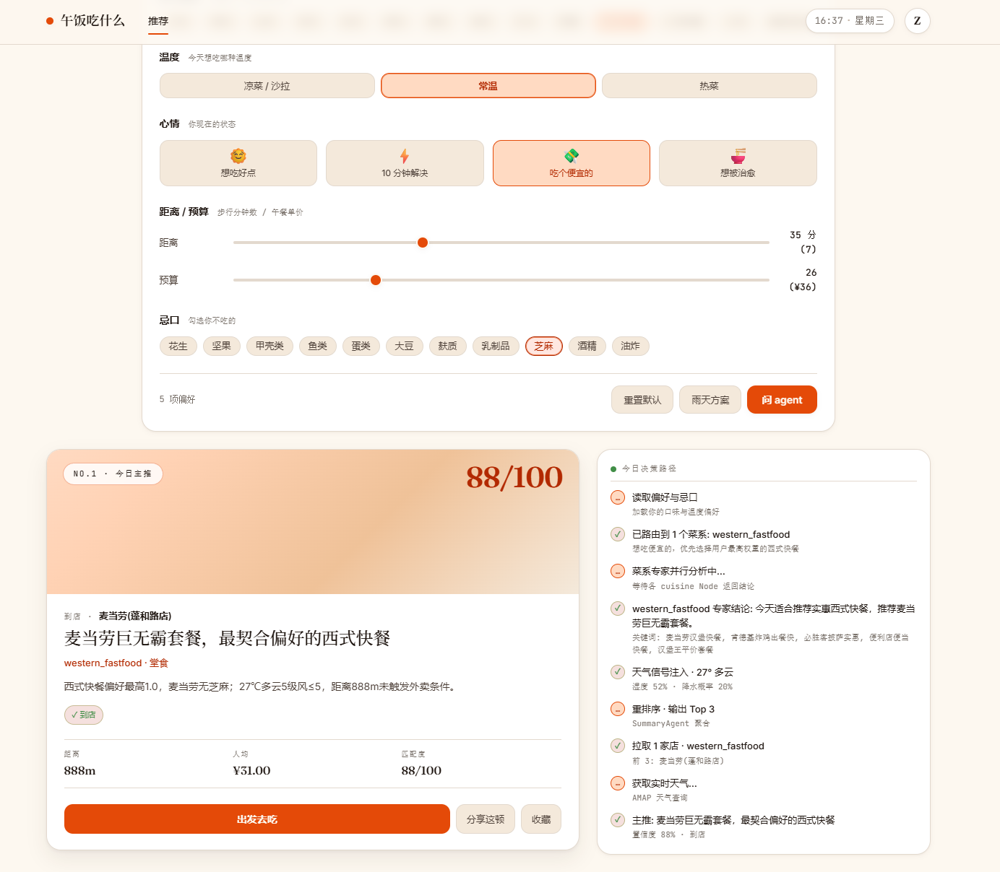

# 🍱 food-order — 你的午餐决策助手

> 一个面向办公室打工人的 **AI Agent 午餐决策系统**：结合你的口味、忌口、当前天气和附近餐厅，给出"今天吃啥 / 要不要点外卖 / 去哪家"的最终建议。



---

## ✨ 这是什么

`food-order` 不做外卖下单、不做商家后台 —— 它是一个**对话式午餐顾问**：

- 你打开网页，告诉它"今天想吃辣的"或者随便说一句"随便推荐"；
- 后端的 **LangGraph 多 Agent 系统** 路由到合适的菜系专家（川菜 / 粤菜 / 西餐 / 日料 / 小吃 …），并行去高德地图搜索附近餐厅、拉取实时天气；
- 总结 Agent 综合所有信号给你一个**主推 + 2 张备选**，并告诉你"今天该不该出门 / 直接点外卖"。

> 当前里程碑：**M1 Agent MVP** —— 偏好管理、14 菜系专家、SSE 流式推荐、Web 聊天壳、ESLint/typecheck/pytest 质量门均已落地。剩 1 个 pytest 历史遗留（pre-existing, F003/F040）+ Playwright 6 个依赖真实高德 API 的 spec 待 mock 化。

---

## 🌟 项目亮点

| | |
|---|---|
| 🧠 **多 Agent 编排** | 基于 [LangGraph](https://langchain-ai.github.io/langgraph/) 的 StateGraph：主路由 → 菜系专家（并行 fanout）→ 高德搜索 → 天气 → 总结 Agent，**14 个菜系专家统一契约**，每个一份独立 spec。 |
| 🗺️ **真实世界信号** | 接 [高德 MCP](https://lbs.amap.com/)：周边餐厅搜索 + 实时/未来天气；推荐不靠"拍脑袋"，而是用你身边的店 + 当下的天。 |
| 🧾 **规格驱动（SDD）** | `spec/` 是单一事实来源（SSOT），CLAUDE.md / README / 代码不得与 spec 冲突；每个 feature 一份 spec + 验收清单 + ADR 决策记录。 |
| ✅ **测试驱动（TDD）** | RED → GREEN → IMPROVE 三步循环；后端 pytest + 覆盖率门槛 80%，前端 Vitest + Playwright E2E。 |
| 🪪 **LLM 提示词作为 first-class 资产** | 14 个菜系片段、router / summary 模板统一放在 `backend/app/agents/prompts/`，文案与业务代码解耦（详见 [ADR 0003](spec/adr/0003-prompts-as-first-class-assets.md)）。 |
| 🔐 **隐私优先** | M1 **不做登录** —— 用户身份是一个前端生成的 UUID（`X-User-Id` 请求头 + cookie）；偏好按 UUID 隔离，其他用户不可见。 |
| 🌐 **真实的中文场景** | 菜系、口味（辣度 / 温度偏好）、忌口、距离 / 预算滑杆、心情 mood 按钮 —— 全部为中文办公场景设计。 |
| 🧱 **小而清晰** | 函数 < 50 行，文件 < 800 行，嵌套 < 4 层 —— 继承自全局编码规则，避免"巨型 node"。 |

---

## 🏛️ 架构设计

```text
┌──────────────────────────────────────────────────────────────────┐
│                  frontend/  Vite + React 18 + TS                 │
│   ┌──────────────────────────────────────────────────────────┐   │
│   │  PreferencesPanel  ·  AddressPickerDialog  ·  ChatShell  │   │
│   │  (Zustand)           (5 级选址组件 / F051)   (SSE 渲染)  │   │
│   └──────────────────────────────────────────────────────────┘   │
│              │                                ▲                  │
│              ▼                                │                  │
│      PUT  /api/v1/preferences          POST /api/v1/agent/chat   │
│      GET  /api/v1/preferences          (text/event-stream)        │
└──────────────────────────────────────────────────────────────────┘
               │                                │
               ▼                                ▼
┌──────────────────────────────────────────────────────────────────┐
│                  backend/  FastAPI 0.110+                         │
│                                                                  │
│   api/v1/  ── router ──▶ services/  ──▶  agents/                 │
│                                       ┌───────────────────────┐  │
│                                       │   LangGraph Workflow  │  │
│                                       │                       │  │
│                                       │  load_preferences     │  │
│                                       │        │              │  │
│                                       │        ▼              │  │
│                                       │    route  (F002)      │  │
│                                       │   /  │  \             │  │
│                                       │  ▼   ▼   ▼  (fanout)  │  │
│                                       │ cuisine cuisine ...   │  │
│                                       │  experts (14×, F003)  │  │
│                                       │  │ │ │                │  │
│                                       │  ▼ ▼ ▼                │  │
│                                       │  search_restaurants   │  │
│                                       │  fetch_weather        │  │
│                                       │   │      │            │  │
│                                       │   ▼      ▼            │  │
│                                       │   summarize  (F040)   │  │
│                                       │        │              │  │
│                                       │        ▼  SSE stream  │  │
│                                       └───────────────────────┘  │
│                                                                  │
│   agents/prompts/  ← first-class 提示词（与业务代码分离）          │
│   models/  SQLModel · MySQL 8 · Alembic                           │
│   mcp/amap/  高德 MCP 客户端（餐厅 / 天气 / 行政区 / 地理编码）    │
└──────────────────────────────────────────────────────────────────┘
```

**关键设计取舍**（详见 `spec/adr/`）：

- **多 Agent vs 单体 LLM**：把口味决策拆成 14 个菜系专家，每位有独立 prompt + 调优空间；router 只负责分发。
- **M1 不做登录**：偏好用匿名 UUID 隔离，M2 再上 JWT（避免 M1 阶段被鉴权/账号体系拖慢）。
- **单表 `user_preferences`**：M1 只一张业务表；不维护商家 / 菜品 / 订单 —— 餐厅信息来自高德实时拉取。
- **SSE 流式**：把 router 决策 / 搜索进度 / 天气注入都做成事件，前端实时绘制"思考流"aside 面板。

---

## 🛠️ 技术栈

| 层 | 选型 |
|---|---|
| 前端 | Vite 5 + React 18 + TypeScript，Zustand 状态，TanStack Query 服务端态，React Router v6 |
| 后端 | FastAPI 0.110+ + Python 3.11+，SQLModel（SQLAlchemy 2.0 + Pydantic v2），Alembic 迁移 |
| 数据库 | MySQL 8（`utf8mb4`，毫秒精度时间戳） |
| Agent 编排 | LangGraph 0.2.x（StateGraph + 并行 fanout + Annotated reducer） |
| LLM | OpenAI 兼容协议（默认 `MiniMax-M3`，可切换） |
| 外部数据 | 高德开放平台 MCP（POI 搜索 / 天气 / 行政区 / 地理编码） |
| 鉴权 | M1：UUID + `X-User-Id`；M2：JWT (HS256) + argon2 哈希 |
| 测试 | pytest + httpx + pytest-asyncio + pytest-cov（≥80%）/ Vitest + Testing Library + Playwright |
| 静态检查 | ruff + mypy（后端）/ ESLint + Prettier（前端） |
| Python 环境 | conda env `food-order`（强制） |
| 包管理 | pnpm（前端，**不要**用 npm / yarn） |

---

## 🚀 5 分钟启动

### 0. 前置依赖

| 工具 | 版本 |
|---|---|
| conda / miniconda | ≥ 23 |
| Node.js | ≥ 20 |
| pnpm | ≥ 9 |
| MySQL 8 | 8.x（M1 需要；M0 骨架仅 `/healthz` 不需要） |

### 1. 克隆 + 准备环境

```bash
git clone <your-fork-url> food-order
cd food-order
cp .env.example .env
# 编辑 .env：至少填 JWT_SECRET、AMAP_API_KEY、MINIMAX_API_KEY
conda create -n food-order python=3.11 -y
conda run -n food-order pip install -r backend/requirements.txt
```

### 2. 起后端（终端 A）

```bash
conda activate food-order
uvicorn backend.app.main:app --reload --port 8000
```

打开 http://localhost:8000/healthz 应返回 `{"status":"ok"}`，http://localhost:8000/docs 看 Swagger UI。

### 3. 起前端（终端 B）

```bash
cd frontend
pnpm install
pnpm dev    # http://localhost:5173
```

### 4. 跑迁移（M1 必跑）

```bash
conda run -n food-order alembic upgrade head   # 应用最新迁移
```

---

## ☁️ 部署（极光云 · 单机一体）

> **首次生产部署** 见 [`docs/deployment.md`](docs/deployment.md)；架构决策见 [ADR 0004](spec/adr/0004-deployment-on-jaguar-cloud.md)；验收清单见 [F060](spec/features/F060-deployment.md)。

### 一图流

```text
┌─────────────────────────────────────────────────────┐
│       极光云 Ubuntu 22.04 LTS（单台 2C4G 起步）        │
│                                                     │
│   Nginx :80/:443 (Let's Encrypt)                    │
│     ├─ /api/* → 127.0.0.1:8000 (uvicorn · systemd)  │
│     └─ /*      → /var/www/food-order/dist/ (SPA)    │
│                                                     │
│   uvicorn  ← systemd: food-order-backend.service    │
│   MySQL 8 (127.0.0.1:3306, 仅本机)                   │
│   备份 /var/backups/food-order/db/  (·7 天保留)      │
└─────────────────────────────────────────────────────┘
```

### 一次性

```bash
# 在服务器上：git clone <repo> 到 /opt/food-order
sudo bash /opt/food-order/scripts/setup-server.sh   # 装 nginx/mysql/conda/env
sudo cp /opt/food-order/.env.example /opt/food-order/.env
sudo -u food-order vi /opt/food-order/.env          # 填 JWT_SECRET/DB_PWD/API_KEY
sudo bash /opt/food-order/scripts/setup-server.sh   # （见 docs/ §2 后续手动步骤）
```

### 每次发布

```bash
# 本地
cd frontend && pnpm build && cd ..
tar czf release.tar.gz backend frontend/dist scripts deploy
scp release.tar.gz user@server:/tmp/

# 服务器
sudo bash /opt/food-order/scripts/deploy.sh /tmp/release.tar.gz
```

### 回滚

```bash
sudo bash /opt/food-order/scripts/rollback.sh              # 列出可回滚版本
sudo bash /opt/food-order/scripts/rollback.sh 20260909_210000   # 回滚到指定时间戳
```

完整步骤 / 凭据清单 / 安全 checklist / 排错速查见 [`docs/deployment.md`](docs/deployment.md)。

---

## 🧪 跑测试 / 静态检查

```bash
# 后端
conda run -n food-order pytest --cov=app                # 单元 + 集成（目标 ≥ 80%）
conda run -n food-order ruff check backend              # lint
conda run -n food-order ruff format backend             # format
conda run -n food-order mypy backend                    # 类型检查

# 前端
cd frontend
pnpm test                 # Vitest 单测
pnpm test:watch           # watch 模式
pnpm typecheck            # tsc -b
pnpm lint                 # ESLint（max-warnings 0）
pnpm build                # tsc + vite build
pnpm test:e2e             # Playwright E2E（先 pnpm exec playwright install）
```

---

## 🔄 开发方法论

### SDD — 规格驱动

`spec/` 是单一事实来源。**先写 spec，再写代码**；CLAUDE.md / README / 代码不得与 spec 冲突。

| 文件 | 内容 |
|---|---|
| [`spec/product.md`](spec/product.md) | 产品定位、目标用户、核心场景 |
| [`spec/features.md`](spec/features.md) | 功能列表 + 优先级（F-ID 唯一编号） |
| [`spec/features/`](spec/features) | 每个 feature 一份 spec（用户故事 + 验收清单） |
| [`spec/api.md`](spec/api.md) | REST 接口契约 |
| [`spec/data-model.md`](spec/data-model.md) | 表结构 / 字段 / 约束 |
| [`spec/adr/`](spec/adr) | 架构决策记录（MADR 模板） |
| [`spec/roadmap.md`](spec/roadmap.md) | 里程碑 |

### TDD — 测试驱动

每个功能 / bug 修复： **RED（先写失败测试）→ GREEN（最小实现）→ IMPROVE（重构）**。

- 覆盖率门槛：**≥ 80%**（行 + 分支，按模块统计）
- 测试结构 AAA（Arrange / Act / Assert）
- 命名：`test_<行为>_<条件>_<期望>`

### Git 工作流

- 分支：`feat/` `fix/` `docs/` `refactor/` `chore/`
- 提交：Conventional Commits（**type 保持英文**，标题 / 正文中文）
- PR 评审 ≥ 1 人；触及鉴权 / 支付 / 数据模型 ≥ 2 人
- **所有破坏性 git 操作均被全局禁用**（详见 [CLAUDE.md §全局警示](CLAUDE.md)）

---

## 🛣️ 路线图

| 里程碑 | 范围 | 状态 |
|---|---|---|
| **M0** 骨架 | FastAPI `/healthz` + Vite 默认页 + spec 目录 | ✅ 已完成 |
| **M1 Agent MVP** | LangGraph 多 Agent + 14 菜系专家 + 高德 MCP + Web 聊天壳 + 用户偏好 | ✅ 主体完成（剩 1 个 pytest pre-existing + Playwright mock 化） |
| **F060 首次部署** | 极光云单机一体 · Nginx 反代 · systemd uvicorn · 本机 MySQL · 手动脚本 · 备份 | ✅ 完成（决策见 [ADR 0004](spec/adr/0004-deployment-on-jaguar-cloud.md)） |
| M2 体验增强 | 登录态、历史记录、收藏夹、反馈回写 + **M1 质量门收口**（mypy/ruff/Playwright） | ⏳ 待 F060 上线稳定后 |
| M3 商业化 | 推荐准确率看板、多城市、第三方外卖深链接 | ⏳ 待 M2 |

M1 详细验收清单见 [`spec/roadmap.md`](spec/roadmap.md)。

---

## 📁 项目结构

```
food-order/
├── CLAUDE.md                  # 仓库级开发规则（必读）
├── README.md                  # 本文件
├── screenshot.png             # 前端预览
├── .env.example               # 环境变量模板
│
├── spec/                      # ⭐ SDD 单一事实来源
│   ├── product.md
│   ├── features.md
│   ├── features/              # F001…F051 一份一份
│   ├── api.md
│   ├── data-model.md
│   ├── adr/                   # 架构决策记录
│   └── roadmap.md
│
├── backend/                   # FastAPI 后端
│   ├── app/
│   │   ├── api/v1/            # 路由（preferences / agent chat / ...）
│   │   ├── agents/            # LangGraph 编排
│   │   │   ├── nodes/         #   每个 Node 一文件
│   │   │   ├── cuisines/      #   14 菜系专家
│   │   │   └── prompts/       #   first-class 提示词
│   │   ├── mcp/amap/          # 高德 MCP 客户端
│   │   ├── models/  schemas/  services/  core/
│   ├── migrations/            # Alembic
│   └── tests/
│
├── frontend/                  # Vite + React 前端
│   └── src/
│       ├── features/          # 按业务领域切片（chat / address / ...）
│       ├── routes/  components/  stores/  lib/  types/  styles/
│
├── prototype/                 # 视觉基线（HTML 静态参考，不进构建）
├── docs/                      # 工程文档
│   └── deployment.md          #   部署手册（F060 / 极光云单机一体）
├── deploy/                    # 部署配置（不进运行时；由 setup-server.sh / deploy.sh 引用）
│   ├── nginx/food-order.conf
│   ├── systemd/food-order-backend.service
│   └── env/food-order.env.production
└── scripts/                   # 端到端冒烟脚本 + 运维脚本
    ├── setup-server.sh        #   服务器一次性初始化（幂等）
    ├── deploy.sh              #   部署新版（含备份 / 迁移 / 重启 / 探活）
    ├── rollback.sh            #   回滚到指定时间戳版本
    └── backup-db.sh           #   mysqldump 备份（cron 每日 03:00）
```

完整目录约定与"为什么这么组织"见 [CLAUDE.md](CLAUDE.md)。

---

## 🤝 贡献

PR 流程：

1. 从最新 `main` 切分支，命名 `feat/<F-ID>-<slug>`（如 `feat/F040-summary-agent`）
2. 在 `spec/features/` 增加 / 修改 spec（先 spec 后代码）
3. 写测试（RED），实现（GREEN），重构（IMPROVE），覆盖率 ≥ 80%
4. 自查清单：lint / typecheck / 测试 / 手跑冒烟脚本
5. PR 标题用 Conventional Commits；正文列：动机 / 改动摘要 / 测试计划 TODO

详见 [CLAUDE.md](CLAUDE.md)。

---

## 📚 进一步阅读

- [CLAUDE.md](CLAUDE.md) — 仓库规则、编码风格、安全基线
- [spec/product.md](spec/product.md) — 产品定位与核心场景
- [spec/features.md](spec/features.md) — 功能列表与优先级
- [spec/api.md](spec/api.md) — REST 接口契约
- [spec/data-model.md](spec/data-model.md) — 数据模型
- [spec/roadmap.md](spec/roadmap.md) — 里程碑
- [spec/adr/0002-ai-agent-pivot.md](spec/adr/0002-ai-agent-pivot.md) — 转向 AI Agent 的决策记录
- [spec/adr/0003-prompts-as-first-class-assets.md](spec/adr/0003-prompts-as-first-class-assets.md) — 提示词 first-class 资产化
- [spec/adr/0004-deployment-on-jaguar-cloud.md](spec/adr/0004-deployment-on-jaguar-cloud.md) — 极光云单机一体部署架构
- [docs/deployment.md](docs/deployment.md) — 端到端部署手册

---

## 📝 License

本仓库采用 **MIT License** —— 详见根目录 [`LICENSE`](LICENSE)。
允许任何人免费商用 / 改 / 卖 / fork，**唯一义务**是在分发时保留版权声明与本许可声明；
作者 / 版权人不提供任何质量担保，不承担任何损害责任。